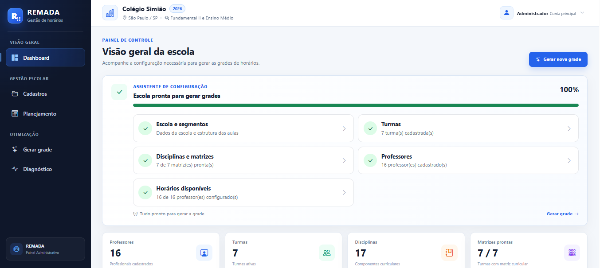
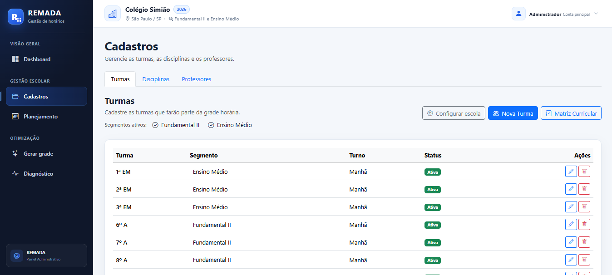
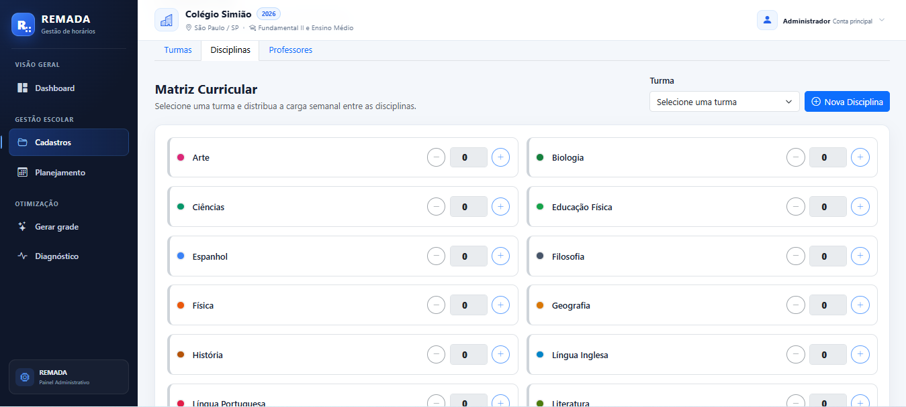
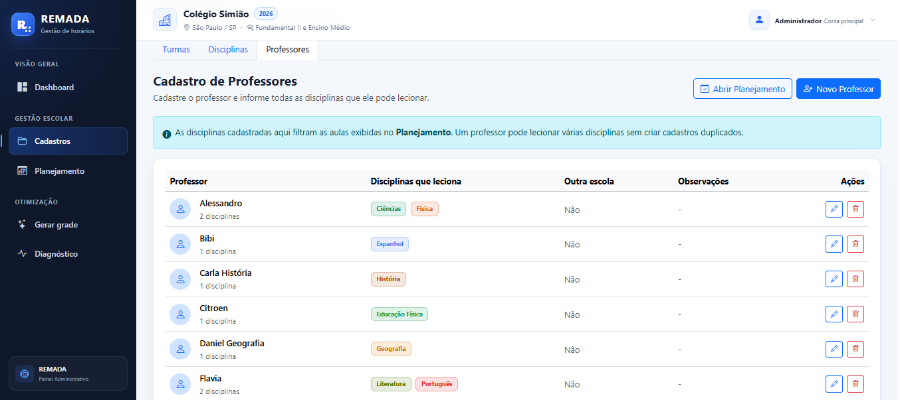
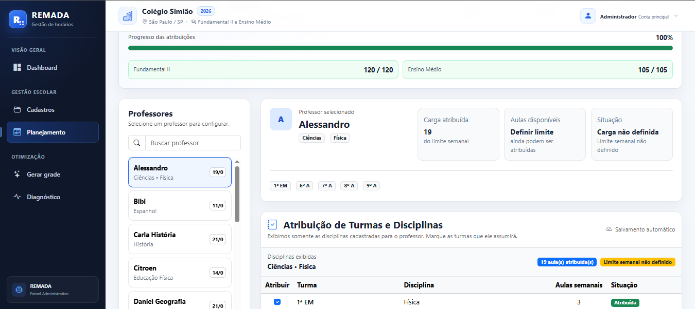
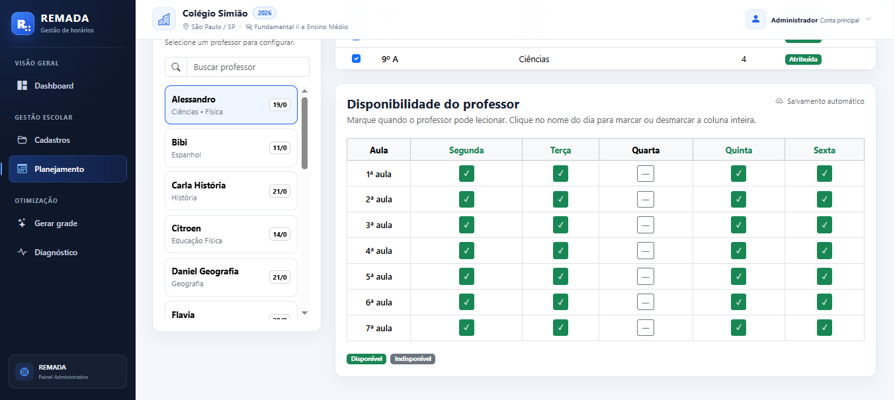
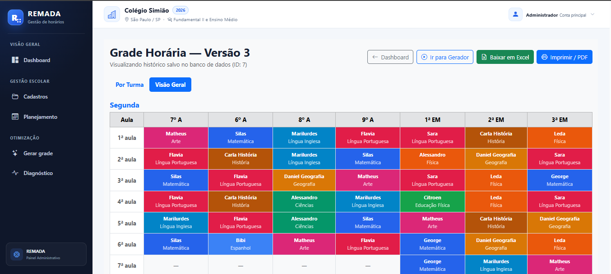

<p align="center">
  
</p>

<h1 align="center">REMADA</h1>

<p align="center">
<b>Intelligent School Timetable Management Platform</b>
</p>

<p align="center">
Sistema SaaS para gestão e geração inteligente de grades horárias escolares utilizando otimização matemática com Google OR-Tools CP-SAT.
</p>

<p align="center">


</p>

---

# Visão Geral

O **REMADA** é uma plataforma desenvolvida para automatizar a construção de grades horárias escolares.

O sistema permite configurar toda a estrutura da instituição — professores, disciplinas, turmas, matriz curricular e disponibilidades — para que o motor de otimização gere automaticamente uma grade consistente respeitando regras pedagógicas e operacionais.

O objetivo é reduzir conflitos, eliminar retrabalho e diminuir significativamente o tempo gasto na elaboração manual das grades.

---

# Principais Recursos

- ✅ Plataforma Web completa
- ✅ Estrutura Multi-escola
- ✅ Dashboard Administrativo
- ✅ Cadastro de Professores
- ✅ Cadastro de Disciplinas
- ✅ Cadastro de Turmas
- ✅ Configuração Horária por Segmento
- ✅ Matriz Curricular
- ✅ Planejamento Docente
- ✅ Disponibilidade dos Professores
- ✅ Geração Automática de Grades
- ✅ Histórico de Gerações
- ✅ Visualização por Turma
- ✅ Visão Geral da Escola
- ✅ Exportação para Excel
- ✅ Impressão em PDF

---

# Tecnologias

| Backend | Frontend | Banco de Dados | Otimização |
|----------|-----------|----------------|------------|
| Python | HTML5 | PostgreSQL | Google OR-Tools |
| Flask | Bootstrap 5 | SQLAlchemy | CP-SAT |
| Jinja2 | JavaScript | | |

---

# Arquitetura

```text
                  Usuário
                      │
                      ▼
        HTML • Bootstrap • JavaScript
                      │
                      ▼
              Aplicação Flask
                      │
                      ▼
            Camada de Serviços
                      │
          ┌───────────┴───────────┐
          ▼                       ▼
     PostgreSQL            Google OR-Tools
                                 CP-SAT
```

---

# Fluxo do Sistema

```text
Cadastro da Escola
        ↓

Cadastro de Turmas
        ↓

Matriz Curricular
        ↓

Cadastro de Professores
        ↓

Planejamento Docente
        ↓

Disponibilidade
        ↓

Geração da Grade
        ↓

Visualização
        ↓

Excel / PDF
```

---

# Interface

## Landing Page

<p align="center">

</p>

---

## Dashboard

<p align="center">

</p>

---

## Cadastro de Turmas

<p align="center">

</p>

---

## Matriz Curricular

<p align="center">

</p>

---

## Cadastro de Professores

<p align="center">

</p>

---

## Planejamento Docente

<p align="center">

</p>

---

## Disponibilidade dos Professores

<p align="center">

</p>

---

## Grade Gerada

<p align="center">

</p>

---

# Motor de Otimização

O REMADA utiliza o **Google OR-Tools CP-SAT**, um solver de programação por restrições utilizado em problemas reais de otimização.

Durante a geração da grade o algoritmo considera simultaneamente:

- disponibilidade dos professores;
- carga horária semanal;
- matriz curricular;
- conflitos de horário;
- limite diário por disciplina;
- distribuição equilibrada da carga;
- regras pedagógicas.

O objetivo é produzir automaticamente uma solução consistente minimizando conflitos e penalidades.

---

# Resultado Atual

O fluxo principal do sistema encontra-se totalmente funcional.

Em um dos testes completos foram processados aproximadamente:

- 7 Turmas
- 16 Professores
- 17 Disciplinas
- Centenas de disponibilidades
- Dezenas de atribuições docentes
- Milhares de variáveis de decisão

O solver encontrou uma solução viável respeitando todas as restrições cadastradas.

---

# Estrutura do Projeto

```text
REMADA
│
├── assets/
├── docs/
├── models/
├── routes/
├── services/
│   └── motor/
│       └── cp_sat/
├── static/
├── templates/
│
├── app.py
├── config.py
├── requirements.txt
└── README.md
```

---

# Roadmap

## Concluído

- ✔ Estrutura Multi-escola
- ✔ Dashboard Administrativo
- ✔ Cadastro Completo
- ✔ Matriz Curricular
- ✔ Planejamento Docente
- ✔ Disponibilidade dos Professores
- ✔ Motor CP-SAT
- ✔ Geração Automática
- ✔ Histórico
- ✔ Exportação Excel
- ✔ Impressão PDF

## Próximas Versões

- 🚧 Diagnóstico da qualidade da grade
- 🚧 Índice de eficiência da solução
- 🚧 Preferências pedagógicas configuráveis
- 🚧 Redução automática de janelas
- 🚧 Relatórios analíticos
- 🚧 Controle de usuários e permissões

---

# Objetivo

O REMADA está sendo desenvolvido como uma plataforma SaaS para auxiliar coordenadores e gestores escolares na geração inteligente de grades horárias por meio de técnicas modernas de otimização matemática.

---

# Autor

**Silas Simião da Silva**

Professor de Matemática • Desenvolvedor Python

GitHub: https://github.com/Simiao-png